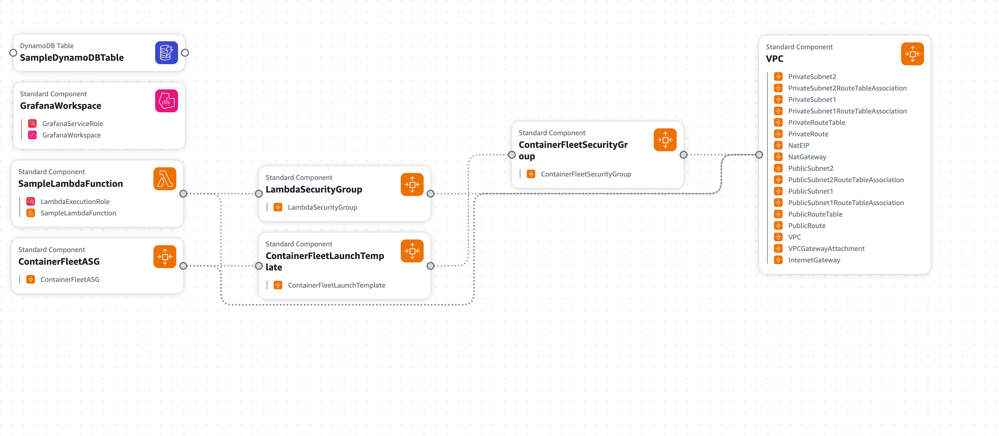

# Observability POC CloudFormation Template

This repository contains CloudFormation templates that provision a Proof-of-Concept (POC) observability solution on AWS. The templates set up a compact, dedicated VPC and deploy several key resources:

- **AWS Managed Grafana Workspace:**  
  Pre-configured with a CloudWatch data source to visualize metrics from various AWS services.
- **Sample Lambda Function:**  
  Deployed within private subnets for secure execution, demonstrating how to monitor serverless functions via CloudWatch.
- **Container Fleet (Auto Scaling Group):**  
  EC2 instances running the Amazon CloudWatch Agent to push host-level metrics (CPU, memory, disk) to CloudWatch. This simulates a dynamic fleet of container hosts.
- **DynamoDB Table:**  
  A sample table to illustrate monitoring of a fully managed AWS database service via CloudWatch.
- **Networking Components:**  
  A compact VPC with public and private subnets, an Internet Gateway, a NAT Gateway, and the necessary route tables and associations to ensure secure and efficient network connectivity.

---

## Resource Breakdown

### 1. VPC and Networking

- **VPC (10.0.0.0/24):**  
  Provides an isolated network for all resources. A compact /24 CIDR block was chosen to minimize wasted IP addresses while leaving room for future expansion.

- **Internet Gateway & VPC Gateway Attachment:**  
  The Internet Gateway allows public internet connectivity. The gateway attachment connects the IGW to our VPC.

- **Public Subnets (10.0.0.0/27 and 10.0.0.32/27):**  
  These subnets are used for launching EC2 instances (the container fleet). They’re configured to assign public IP addresses on launch.

- **Private Subnets (10.0.0.64/27 and 10.0.0.96/27):**  
  Dedicated for resources that do not need to be directly accessible from the internet—such as the Lambda function.

- **Route Tables and Associations:**  
  - **Public Route Table:** Routes all outbound traffic (0.0.0.0/0) through the Internet Gateway.  
  - **Private Route Table:** Routes traffic from the private subnets to the internet via the NAT Gateway.

- **NAT Gateway (with Elastic IP):**  
  Enables resources in the private subnets to access the internet (for example, to download updates or send metrics) while keeping them isolated from inbound public access.

---

### 2. Observability Resources

- **AWS Managed Grafana Workspace:**  
  A fully managed Grafana instance pre-configured with a CloudWatch data source. This allows you to visualize metrics from CloudWatch (including those pushed by the CloudWatch Agent on the EC2 instances, as well as metrics from Lambda and DynamoDB).  
  - **Grafana Service Role:** Grants the Managed Grafana workspace the necessary permissions (e.g., CloudWatchReadOnlyAccess) to fetch metrics.

---

### 3. Application Resources

- **Sample Lambda Function:**  
  A basic Node.js function deployed into private subnets. It logs a message and returns a simple response.  
  - **Lambda Execution Role:** Uses `AWSLambdaBasicExecutionRole` and `AWSLambdaVPCAccessExecutionRole` so the function can write logs and manage its network interfaces when running in the VPC.  
  - **Lambda Security Group:** Controls inbound and outbound traffic for the Lambda function within the VPC.

- **Container Fleet (Auto Scaling Group):**  
  A dynamic group of EC2 instances launched in the public subnets to simulate a containerized environment.
  - **Launch Template:** Defines the EC2 instance configuration including instance type, key pair, security group, and a user data script.  
    - **User Data Script:** Installs and configures the Amazon CloudWatch Agent, which collects host-level metrics (e.g., CPU, disk, memory) and pushes them to CloudWatch.
  - **Container Fleet Security Group:** Allows SSH access (for administration) and unrestricted outbound traffic.

- **Sample DynamoDB Table:**  
  A simple DynamoDB table using on-demand billing (PAY_PER_REQUEST) to demonstrate monitoring of a managed database service via CloudWatch.

---

### 4. EC2 Grafana Instance

- **Grafana EC2 Instance:**  
  An EC2 instance running Grafana, pre-configured to visualize metrics from CloudWatch.
  - **Grafana EC2 Role:** Grants the necessary permissions to the EC2 instance to read metrics from CloudWatch.
  - **Grafana Security Group:** Controls inbound and outbound traffic for the Grafana instance.

> **Note:** The EC2 Grafana instance is intended to be a temporary solution. The preferred approach is to use the AWS Managed Grafana for a fully managed and scalable observability solution.

---

## Deployment Instructions

### Prerequisites
1. have AWS CLI@v2 installed

### Steps
1. make sure to login to AWS in the CLI
2. `$ cd coe-aws-observability`
3. `$ sh run.sh <PROFILE_NAME> <REGION> <TEMPLATE>` where:
    - `<PROFILE_NAME>` is the AWS CLI profile name
    - `<REGION>` is the AWS region to deploy the resources
    - `<TEMPLATE>` is the path to the CloudFormation template file (e.g., `template.yaml` or `template-ec2-grafana.yaml`)

### To delete the resources
3. `$ sh delete.sh <PROFILE_NAME> <REGION>` where:
    - `<PROFILE_NAME>` is the AWS CLI profile name
    - `<REGION>` is the AWS region to deploy the resources