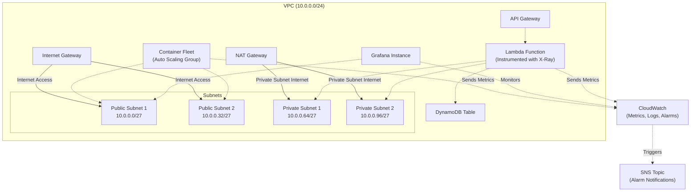

# AWS Observability Architecture

## Overview

This CloudFormation template creates a comprehensive observability solution in AWS, demonstrating native monitoring and logging capabilities across multiple services.

## Architecture Components

### Network Infrastructure
- **VPC**: 10.0.0.0/24 CIDR block
- **Subnets**: 
  - 2 Public Subnets (10.0.0.0/27 and 10.0.0.32/27)
  - 2 Private Subnets (10.0.0.64/27 and 10.0.0.96/27)
- **Internet Gateway** for public internet access
- **NAT Gateway** for private subnet internet connectivity

### Compute and Services
1. **Lambda Function**
   - Instrumented with AWS X-Ray
   - Deployed in private subnets
   - Integrated with API Gateway
   - Connects to DynamoDB

2. **Container Fleet**
   - Auto Scaling Group
   - Deployed in public subnets
   - Configured with CloudWatch Agent for metrics collection

3. **Grafana Instance**
   - Deployed in public subnet
   - Used for visualization and monitoring

4. **API Gateway**
   - Regional endpoint
   - Proxy integration with Lambda
   - Configured with logging and tracing

5. **DynamoDB Table**
   - Serverless NoSQL database
   - Pay-per-request billing mode

### Observability Stack
- **CloudWatch**
  - Metrics collection
  - Log aggregation
  - Alarm monitoring

- **X-Ray**
  - Distributed tracing
  - Performance insights

- **SNS Topic**
  - Alarm notifications
  - Centralized alert management

## Monitoring Highlights
- Lambda error rate monitoring
- EC2 instance CPU and memory stress alarms
- Auto Scaling Group performance tracking

## Security Considerations
- VPC network segmentation
- Security groups for Lambda, EC2 instances
- IAM roles with least privilege
- CloudWatch agent for secure metrics collection

## Deployment Notes
- Uses CloudFormation for infrastructure as code
- Supports region-specific AMI selection
- Configurable SSH access and instance types

## Potential Improvements
- Add more granular CloudWatch alarms
- Implement more advanced Grafana dashboards
- Consider using AWS Managed Grafana for enhanced integration

## Diagram

## License
[Specify your license or usage terms]

## Contact
[Add contact information or project maintainer details]