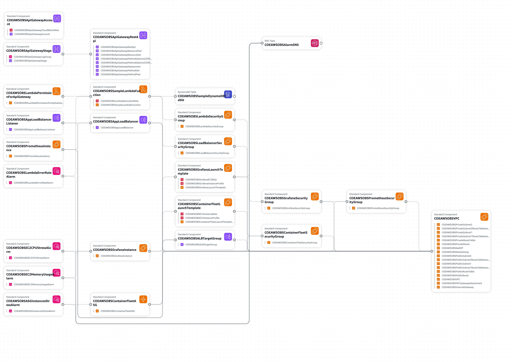

# AWS Observability POC

This POC demonstrates a comprehensive observability solution on AWS using CloudFormation templates. It provisions a dedicated VPC and deploys several key resources for monitoring and observability.

## Architecture Overview



## Components

### 1. VPC and Networking Infrastructure

- **VPC (10.0.0.0/24)**: Isolated network environment for all resources
- **Internet Gateway & VPC Gateway Attachment**: Public internet connectivity
- **Public Subnets (10.0.0.0/27 and 10.0.0.32/27)**: For public-facing resources
- **Private Subnets (10.0.0.64/27 and 10.0.0.96/27)**: For Lambda functions and secure resources
- **Route Tables and Associations**: Proper routing configuration for public and private traffic
- **NAT Gateway (with Elastic IP)**: Internet access for private subnet resources

### 2. API Gateway and Lambda Integration

- **API Gateway REST API**: Regional endpoint with CORS-enabled endpoints
  - `/test` (POST) - Lambda integration endpoint
  - `/test/{id}` (GET) - Lambda integration with path parameters
  - OPTIONS methods for CORS support
- **API Gateway Stage**: Development stage with tracing, metrics, and access logging
- **Sample Lambda Function**: Python 3.12 function deployed in private subnets
  - VPC configuration for secure networking
  - X-Ray tracing enabled
  - DynamoDB integration
  - AWS Lambda Powertools layer included

### 3. Container Fleet and Load Balancing

- **Application Load Balancer**: Internet-facing ALB for container fleet access
- **ALB Target Group**: Health checks on port 9100 for Prometheus metrics
- **Auto Scaling Group**: Dynamic EC2 instances (1-3 instances)
  - CloudWatch Agent for system metrics
  - Prometheus Node Exporter for application metrics
  - Automatic scaling based on demand

### 4. Observability and Monitoring Stack

- **Prometheus Server**: Self-hosted Prometheus instance on EC2
  - Scrapes metrics from container fleet via ALB
  - Scrapes metrics from Grafana instance
  - Custom configuration for multi-target monitoring
- **Grafana Instance**: Self-hosted Grafana on EC2
  - CloudWatch data source integration
  - Prometheus Node Exporter for system metrics
  - IAM role with CloudWatch read permissions

### 5. Data Storage

- **DynamoDB Table**: Sample table with on-demand billing
  - Used by Lambda function for data operations
  - Integrated with observability stack
- **S3 Bucket**: Deployment bucket for Lambda code artifacts
  - Secure configuration with public access blocked
  - Regional bucket for Lambda deployments

### 6. CloudWatch Alarms and Notifications

- **Lambda Error Rate Alarm**: Monitors Lambda function errors
- **EC2 CPU Stress Alarm**: Monitors Grafana instance CPU utilization
- **EC2 Memory Usage Alarm**: Monitors memory usage via CloudWatch Agent
- **ASG Instances Stress Alarm**: Monitors Auto Scaling Group CPU utilization
- **SNS Topic**: Centralized alarm notifications

### 7. Security and Access Control

- **Security Groups**: Granular network access control
  - Lambda security group for VPC access
  - Container fleet security group (ports 22, 80, 9100)
  - Prometheus security group (ports 22, 80, 9090, 9100)
  - Grafana security group (ports 22, 80, 3000, 9100)
  - Load balancer security group
- **IAM Roles and Policies**:
  - Lambda execution role with VPC, DynamoDB, and X-Ray permissions
  - EC2 instance roles with CloudWatch Agent and SSM permissions
  - Grafana EC2 role with CloudWatch read access
  - API Gateway CloudWatch logging role

## Resource Breakdown

### 1. VPC and Networking

- **VPC (10.0.0.0/24)**: Isolated network for all resources
- **Internet Gateway & VPC Gateway Attachment**: Public internet connectivity
- **Public Subnets (10.0.0.0/27 and 10.0.0.32/27)**: For public-facing resources (ALB, Prometheus, Grafana)
- **Private Subnets (10.0.0.64/27 and 10.0.0.96/27)**: For Lambda functions and secure resources
- **Route Tables and Associations**: Proper routing configuration
- **NAT Gateway (with Elastic IP)**: Internet access for private resources

### 2. API Gateway and Lambda

- **API Gateway REST API**: Regional endpoint with comprehensive CORS support
- **Lambda Function**: Python 3.12 with VPC configuration, X-Ray tracing, and DynamoDB integration
- **API Gateway Logging**: CloudWatch log groups with detailed access logging

### 3. Container Fleet and Load Balancing

- **Application Load Balancer**: Internet-facing ALB for container fleet access
- **Auto Scaling Group**: 1-3 EC2 instances with CloudWatch Agent and Prometheus Node Exporter
- **Target Group**: Health checks on Prometheus metrics endpoint (port 9100)

### 4. Observability Infrastructure

- **Prometheus Server**: Self-hosted on EC2 with custom scraping configuration
- **Grafana Server**: Self-hosted on EC2 with CloudWatch data source integration
- **CloudWatch Alarms**: Comprehensive monitoring for Lambda, EC2, and ASG resources
- **SNS Topic**: Centralized alarm notifications

### 5. Data Storage

- **DynamoDB Table**: On-demand billing for application data
- **S3 Bucket**: Secure deployment bucket for Lambda artifacts

## Deployment Instructions

### Prerequisites
1. AWS CLI v2 installed
2. Python 3.12 installed
3. Valid AWS credentials configured

### Deploy
```bash
cd pocs/01-aws-observability
./scripts/deploy.sh <PROFILE_NAME> <REGION>
```

Where:
- `<PROFILE_NAME>` is your AWS CLI profile name
- `<REGION>` is the target AWS region

### Cleanup
```bash
./scripts/cleanup.sh <PROFILE_NAME> <REGION>
```

## Directory Structure

```
01-aws-observability/
├── README.md                    # This file
├── infrastructure/              # CloudFormation templates
│   ├── cf-template-s3.yaml     # S3 bucket for deployments
│   └── cf-template-infra.yaml  # Main infrastructure
├── lambda/                     # Lambda function code
│   ├── lambda_function.py      # Function implementation
│   └── requirements.txt        # Python dependencies
├── scripts/                    # Deployment scripts
│   ├── deploy.sh              # Deployment script
│   └── cleanup.sh             # Cleanup script
├── docs/                      # Documentation and diagrams
│   ├── poc-aws-obs-architecture-diagram.md
│   ├── aws_observability_poc_diagram.png
│   └── application-composer-poc-observability.png
└── tools/                     # POC-specific tools
    └── diagram-generator/     # Diagram generation utilities
        ├── script.py
        ├── requirements.txt
        └── README.md
```

## Key Features

- **Multi-Layer Observability**: Combines Prometheus metrics, CloudWatch monitoring, and Grafana visualization
- **Secure Architecture**: Private subnets for Lambda functions, comprehensive security groups
- **API-Driven Architecture**: RESTful API Gateway with Lambda integration and CORS support
- **Auto-Scaling Infrastructure**: Dynamic container fleet with Application Load Balancer
- **Comprehensive Monitoring**: CloudWatch alarms for Lambda errors, CPU stress, and memory usage
- **Infrastructure as Code**: Complete CloudFormation automation with two-stack deployment
- **Cost Optimized**: On-demand DynamoDB billing, right-sized instances, and efficient resource allocation
- **Production-Ready Logging**: Structured API Gateway access logs and CloudWatch integration
- **Metrics Collection**: Prometheus Node Exporter on all instances for detailed system metrics 