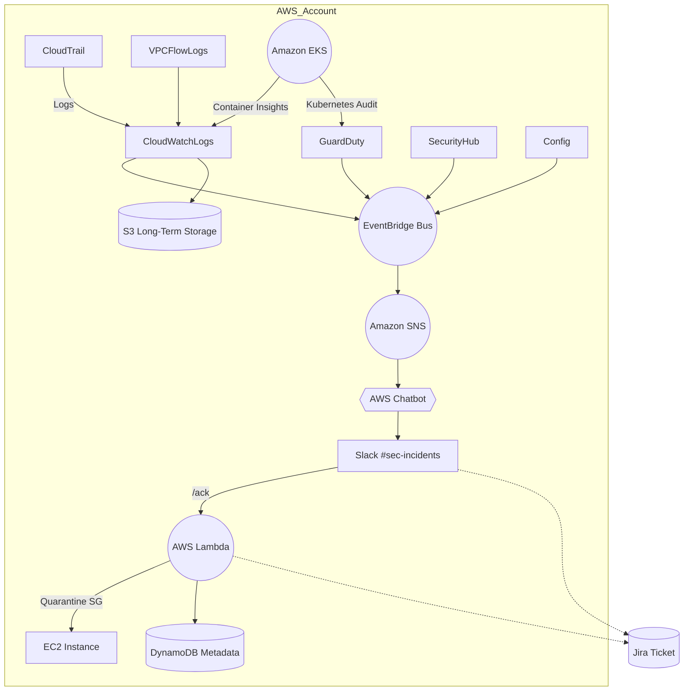

# Security Observability on AWS – Technical Proposal and Phased Implementation Plan

## Table of Contents

1. [Introduction & Executive Summary](#1-introduction--executive-summary)
2. [Problem Statement & Context (Data & Statistics)](#2-problem-statement--context-data--statistics)
3. [Recommendations to Promote the Initiative to the Business](#3-recommendations-to-promote-the-initiative-to-the-business)
4. [Highlighted Use Case: Real‑Time Detection with ChatOps](#4-highlighted-use-case-real-time-detection-with-chatops)
5. [Phased Adoption Strategy (Roadmap)](#5-phased-adoption-strategy-roadmap)
6. [Solution Requirements & Considerations](#6-solution-requirements--considerations)
7. [Proposed Architecture Design](#7-proposed-architecture-design)
8. [Solution Analysis: Benefits & Challenges](#8-solution-analysis-benefits--challenges)
9. [References & Resources](#9-references--resources)

---

## 1. Introduction & Executive Summary

**Executive summary:** *The accelerated migration to the cloud, increasingly strict regulations—at least **137 jurisdictions** now have comprehensive data‑protection laws according to an analysis by the **International Association of Privacy Professionals** (March 2024)—and the average cost of a security breach, which exceeded **USD 4.88 million** in 2024 according to the **Cost of a Data Breach 2024** report by **IBM Security / Ponemon Institute**, make it essential to have a platform that unifies operational observability and security.*

The proposed solution delivers real‑time visibility, automated threat detection, and clear executive metrics, dramatically reducing operational risk and mean time to respond (MTTR) from hours to minutes, while also enabling global regulatory compliance.

### 1.1 Purpose

Establish guidelines for a **native AWS Security Observability solution** that enables Encora and its customers to:

* Detect and respond to incidents at the speed digital business requires.
* Meet frameworks such as PCI‑DSS, SOC 2, and GDPR through continuous auditing.
* Provide actionable insights to both technical teams (SecOps, DevOps) and executive leadership.

### 1.2 Scope of This Document

This document serves as both a *pitch* and a **technical blueprint**, covering:

* Business justification based on data and risk.
* High‑level design of the proposed architecture and its components.
* Phased adoption plan with effort and cost estimates.
* Recommendations to position the initiative with business stakeholders.

### 1.3 Solution Overview

The proposal is a modular platform composed exclusively of AWS managed services (CloudTrail, GuardDuty, Security Hub, Config, CloudWatch, SNS/EventBridge, etc.) that:

1. Centralizes logs, metrics, and security findings from all accounts and regions.
2. Correlates events in real time to generate actionable alerts via **ChatOps**.
3. Provides executive dashboards with a security score and risk trends.
4. Scales on demand and allows advanced controls (Macie, Inspector, automated response) to be added gradually through a **maturity‑level roadmap**.
5. **Lays the groundwork for a future AIOps layer**: standardized telemetry and alert orchestration will enable integration of AI/ML models (e.g., in Amazon Bedrock or SageMaker) for automated diagnostics and remediation recommendations without rearchitecting.

---

## 2. Problem Statement & Context (Data & Statistics)

**Executive summary:** *Distributed workloads on AWS often lack comprehensive security visibility. According to the **Cost of a Data Breach 2024** study by IBM Security / Ponemon Institute, the average time to detect a threat is **\~204 days** and the global average breach cost is **USD 4.88 million**. Without robust security observability, **any organization** risks becoming part of this statistic. This document presents a flexible **blueprint** that enables Encora and its clients to strengthen or complement their security posture. Additionally, **84 % of organizations** already prioritize security observability; maintaining the status quo creates competitive and compliance risk.*

### 2.1 Current Context

* **Diverse AWS accounts and regions:** opportunity to unify observability with a central, extensible plane.
* Operational metrics (CPU, latency, errors) are monitored, but **security findings (GuardDuty, Security Hub, Config) are not easily accessible to development teams**, making correlation with application failures difficult.
* **Incident response is mainly reactive**; critical incidents tie up senior engineers. Early detection and automated playbooks would reduce this burden.
* **Remediation processes are not standardized**; an observability platform documents patterns and enables automation of repetitive steps.
* **Post‑incident documentation & continuous learning** require consolidated evidence (logs, traces, findings); today this data is often scattered and hard to compile.
* Security alerts are **not funneled through a standard ChatOps workflow**; enabling this flow would unify operational conversations and shorten acknowledgment time.
* Critical logs (CloudTrail, VPC Flow Logs) **lack a central correlation layer** that simplifies forensics and compliance.

### 2.2 Key Data & Statistics

| Metric                                                      | 2024 Value             | Source                                                         |
| ----------------------------------------------------------- | ---------------------- | -------------------------------------------------------------- |
| Global average cost of a breach                             | **USD 4.88 M**         | IBM Security / Ponemon Institute, *Cost of a Data Breach 2024* |
| Mean time to identify + contain                             | **204 days + 73 days** | IBM Security, *Cost of a Data Breach 2024*                     |
| Organizations prioritizing “security observability”         | **99 %**               | *State of Security Observability Report 2023*                  |
| Teams planning to replace/extend SIEM with observability    | **42 %**               | *State of Security Observability Report 2023*                  |
| Cloud incidents caused by misconfigurations                 | **≈ 77 %**             | CSA *State of Cloud Security 2024*                             |
| Organizations without a standardized incident‑response plan | **54 %**               | Ponemon, *Cyber Resilient Organization 2023*                   |
| Consumers who switch providers after a breach               | **37 %**               | Cisco, *2024 Consumer Privacy Survey*                          |
| Average stock price drop after a breach                     | **‑7.5 %**             | Comparitech, *Security Breach Stock Impact Study 2023*         |

### 2.3 Business Impact

* **Financial risk:** A single breach at the global average cost would consume more than **13 years** of the estimated annual budget for **Phase 1 (Foundations)** of the platform.

---

## 3. Recommendations to Promote the Initiative to the Business

**Executive summary:** *For this initiative to gain traction beyond the technical sphere, it is crucial to communicate its strategic, financial, and risk‑mitigation value. This section offers guidance on presenting the project convincingly to business audiences, emphasizing alignment with organizational goals and the potential to extend its value with artificial intelligence.*

* **Business Alignment:** The solution directly reduces operational risk, improves response times, and supports regulatory compliance (PCI‑DSS, GDPR, SOC 2). It enables audit responses with clear evidence and standardizes incident handling.
* **ROI & Efficiency:** Leverages native services with scalable costs, reuses existing alert flows (CloudWatch, EventBridge), and automates repetitive tasks (response, tagging, notification). Reduces diagnosis and analysis time for senior engineers.
* **Risk of Inaction:** Organizations without consolidated security observability detect incidents late (204 days on average) with costs exceeding USD 4.8 M per breach, severely impacting reputation, compliance, and market value.
* **Success Stories / Benchmarks:** Companies such as Netflix, Atlassian, and Shopify implement similar practices under the ChatOps model. AWS supports integration with Slack and Teams through AWS Chatbot and promotes use cases that centralize security events and automate remediation.
* **Future Vision / AIOps:** This platform lays the foundation for integrating cognitive capabilities in the future (e.g., automatic recommendations, incident summaries, predictive diagnostics) via LLMs hosted in Amazon Bedrock or models trained in SageMaker. Presenting this vision can align the organization with existing corporate AI strategies.

---

## 4. Highlighted Use Case: Real‑Time Detection with ChatOps

**Executive summary:** *The PoC will validate that **Amazon GuardDuty** and **AWS Security Hub** findings become actionable alerts in a **Slack** channel via **AWS Chatbot** in less than **5 minutes** end‑to‑end. The figures included are objectives based on official documentation; they will be confirmed or adjusted with demo data.*

### 4.1 Scenario Goal

Verify that:

1. A security finding (e.g., *Recon\:EC2/PortScan* from GuardDuty **or** a failed Security Hub control) automatically propagates to ChatOps.
2. The team can acknowledge and trigger a standard containment action from Slack.
3. The full flow (detection → notification → ack → containment) occurs within the target window of **5 minutes**.

### 4.2 Proposed Demo Steps

| # | Step                                 | Service               | Details                                                                                                                                                                          |
| - | ------------------------------------ | --------------------- | -------------------------------------------------------------------------------------------------------------------------------------------------------------------------------- |
| 1 | Simulate GuardDuty finding           | GuardDuty             | Generate *Recon\:EC2/PortScan* with simulated traffic. Publish latency ≤ 5 min (GD User Guide).                                                                                  |
| 2 | Simulate Security Hub finding        | Security Hub          | Intentionally disable a CIS control (e.g., public S3 bucket) so Security Hub marks it **FAILED**. Security Hub receives internal & external findings in \~1 min (SH User Guide). |
| 3 | Publish both findings to EventBridge | EventBridge           | Rule filtering `source = aws.securityhub OR aws.guardduty`. Latency < 1 s (EventBridge SLA).                                                                                     |
| 4 | Notify in Slack                      | SNS → AWS Chatbot     | Enriched message in `#sec‑incidents`. Latency < 1 s.                                                                                                                             |
| 5 | Acknowledge with `/ack <id>`         | Slack (Command)       | Command calls Lambda to isolate the affected resource and add an audit tag.                                                                                                      |
| 6 | Confirm & create ticket              | Lambda → Jira webhook | Bot responds with ✅ and creates an issue.                                                                                                                                        |

### 4.3 Proposed Success Metrics

| Metric                      | Target  | Reference                           |
| --------------------------- | ------- | ----------------------------------- |
| GuardDuty detection time    | ≤ 5 min | AWS Docs “Finding frequency” (2024) |
| EventBridge → SNS publish   | ≤ 1 s   | EventBridge official SLA (2024)     |
| SNS → Slack delivery        | ≤ 1 s   | AWS Chatbot Guide (2024)            |
| MTTA (human acknowledgment) | < 3 min | Google SRE Book §11                 |
| Lambda containment action   | < 30 s  | Typical Lambda execution metrics    |

> *Note:* These values will be recorded during the PoC. Meeting them indicates that the flow meets the minimum real‑time requirements; otherwise, they will highlight bottlenecks for architectural tuning.

### 4.4 Expected Results & Validation

* **Unified visibility:** The finding appears in Slack with enriched fields (type, severity, affected resource, link to Security Hub).
* **Reproducible playbook:** The `/ack` command standardizes the acknowledgment process and triggers the same Lambda for every incident, laying the foundation for more complex actions.
* **Audit traceability:** GuardDuty Finding ID, Slack Thread URL, and Ticket ID are related, satisfying NIST SP 800‑61 r2 §3.4.
* **AIOps foundation:** By centralizing telemetry and events in EventBridge, future phases can add an LLM‑powered bot to analyze the thread and suggest remediations.

### 4.5 Next Steps (post‑PoC)

1. Extend to additional security sources: Macie, Inspector.
2. **Measure end‑to‑end MTTR** in simulated and real incidents to build a baseline.
3. **Codify Runbooks in AWS Systems Manager** and evaluate adding AI recommendations.

---

## 5. Phased Adoption Strategy (Roadmap)

**Executive summary:** *This section presents an incremental plan to adopt the security‑observability platform in three progressive phases—basic visibility, automated detection, and orchestrated response—starting with low risk and cost, demonstrating early value, and enabling future expansion, including advanced AIOps capabilities.*

### 5.1 Implementation Phases

| Phase                         | Scope                                                                                                                                                 | Owners                     | Duration  | Success Criteria                                                                                                       |
| ----------------------------- | ----------------------------------------------------------------------------------------------------------------------------------------------------- | -------------------------- | --------- | ---------------------------------------------------------------------------------------------------------------------- |
| **1 – Foundations**           | CloudTrail, VPC Flow Logs, **Security Hub** (administrator + member accounts), GuardDuty enabled, Slack channel `#sec‑incidents` with AWS Chatbot     | SecOps + DevOps            | 4‑6 weeks | Security Hub findings visible in dashboard & ChatOps notifications < 5 min                                             |
| **2 – Automated Detection**   | Add findings from Config Rules, Macie, Inspector; centralized real‑time dashboards & alerts                                                           | SecOps                     | 4 weeks   | New finding sources appear in shared panels & ChatOps                                                                  |
| **3 – Orchestrated Response** | Integrate SSM Automation, create Runbooks, automatic responses via Lambda; ticketing proof‑of‑concept                                                 | SecOps + DevOps            | 4‑6 weeks | One fully orchestrated use case implemented (ack + containment + ticket)                                               |
| **4 – Cognitive AIOps**       | Add AI capabilities: remediation recommendations, automatic summaries, natural‑language queries; evaluate Amazon Bedrock, SageMaker, or external LLMs | SecOps + AI + Architecture | 6‑8 weeks | Functional assistant in ChatOps channel that answers questions & suggests actions with at least one connected playbook |

### 5.2 Advantages of Gradual Adoption

A phased approach minimizes implementation risk, enables early feedback, and accelerates value delivery. It also aligns technical and business teams, facilitates incremental budgeting, and builds organizational trust. Additionally, it allows safe AI experimentation in later stages and adapts scope to real‑world needs—avoiding over‑engineering and focusing effort where it matters.

---

## 6. Solution Requirements & Considerations

**Executive summary:** *This section outlines the technical and non‑technical requirements to implement Phase 1 of the PoC, focused on security visibility and real‑time operational response using native AWS services. The requirements define a minimum‑viable architecture centered on CloudWatch, EventBridge, Slack (ChatOps), Lambda, and Security Hub, ensuring future extensibility toward automation and AIOps. Corporate governance constraints and the need for portability, flexibility, and repeatability are also considered.*

### 6.1 Technical Requirements

1. Exclusive use of native AWS services (GuardDuty, Security Hub, Config, CloudWatch, EventBridge, Chatbot, Lambda, API Gateway, EKS, DynamoDB, etc.).
2. All services must export metrics & logs to CloudWatch for centralization & visualization.
3. All security findings and business events must be published to a central broker: Amazon EventBridge.
4. Relevant findings must be automatically notified in Slack channels via AWS Chatbot.
5. Slack must allow operational responses with commands (`/ack <id>`) that trigger Lambda flows.
6. Events, findings & metadata must be stored with at least 1‑year retention, ideally in S3 Glacier IA.
7. AWS Lambda functions will process events: isolation, tagging, ITSM integration.
8. The PoC will include an Amazon EKS cluster audited with GuardDuty‑Kubernetes, emitting events to EventBridge.
9. Communication to services in EKS will use API Gateway or ALB with traceability (`X‑Request‑Id`).
10. PoC test data (resources, simulated users, etc.) will be stored in DynamoDB as a decoupled source.

### 6.2 Non‑Technical Considerations

1. Near‑real‑time reactivity is expected (detection + notification + response in < 5 min).
2. The PoC will run in an account under corporate governance policies; services such as AWS Organizations may have restrictions.
3. The solution must be extensible to add more security services or event sources without redesigning the architecture.
4. The solution must be repeatable and declared as Infrastructure as Code (CDK or CloudFormation), versioned and documented.
5. It must be portable—no proprietary tools or connectors outside AWS and must expose standard interfaces (ASFF, OpenTelemetry).
6. It must be flexible to adapt to various environments or teams within the organization.
7. Key metrics (MTTA, visibility, containment) must be recordable and comparable in future phases.
8. The solution must generate traceable evidence (finding + action + ticket) for audits or lessons learned.
9. Incident responses should be standardized via playbooks (SSM Runbooks) and facilitate future automation (AIOps).
10. Future multi‑account & multi‑region scalability will be considered even if the PoC is executed in an isolated environment.

---

## 7. Proposed Architecture Design

**Executive summary:** *This section describes the reference architecture for the PoC, its key components, and the design decisions supporting its modular and scalable structure. The architecture relies exclusively on native AWS services, centralizes events in CloudWatch and EventBridge, guarantees end‑to‑end traceability via ChatOps, and is prepared for future AIOps extensions without re‑architecting.*

### 7.1 Architecture Diagram

### 7.2 Component Description

| Component                            | Function                                                                       | Notes                                                                |
| ------------------------------------ | ------------------------------------------------------------------------------ | -------------------------------------------------------------------- |
| **AWS CloudTrail**                   | Captures API calls & state changes in the account.                             | Primary audit source; multi‑region enabled.                          |
| **VPC Flow Logs**                    | Records VPC/subnet‑level network traffic.                                      | Sent to CloudWatch Logs; 14‑day active retention, 1‑year in S3.      |
| **Amazon GuardDuty**                 | Managed threat detection (analyzes CloudTrail, VPC Flow Logs, DNS, EKS audit). | Includes GuardDuty‑Kubernetes to monitor EKS control plane.          |
| **AWS Security Hub**                 | Aggregates findings & compliance scores (CIS, PCI, etc.).                      | Central admin + member accounts.                                     |
| **AWS Config**                       | Continuous config & compliance evaluation.                                     | Optional Conformance Packs.                                          |
| **Amazon CloudWatch Logs & Metrics** | Operational log & custom metric store.                                         | Container Insights enabled in EKS.                                   |
| **Amazon EventBridge**               | Central event bus (findings, domain events).                                   | Rules per source (`aws.guardduty`, `aws.securityhub`, `custom.app`). |
| **Amazon SNS**                       | Decoupled notification channel.                                                | `security‑alerts` topic subscribed by AWS Chatbot.                   |
| **AWS Chatbot / Slack**              | Delivers alerts & `/ack` commands in ChatOps.                                  | Channel `#sec‑incidents`.                                            |
| **AWS Lambda**                       | Response playbooks (quarantine, tagging, ticket).                              | Deployed via CDK; least‑privilege IAM.                               |
| **Amazon S3**                        | Long‑term log/finding retention.                                               | Glacier IA ≥ 1 year.                                                 |
| **Amazon DynamoDB**                  | Incident metadata persistence (finding ↔ Slack thread ↔ ticket).               | Facilitates postmortems & future AIOps.                              |
| **Amazon EKS**                       | Demo microservices workloads.                                                  | Audited by GuardDuty‑Kubernetes.                                     |
| **API Gateway / ALB**                | Exposes microservice APIs with traceability (`X‑Request‑Id`).                  | Sends metrics to CloudWatch.                                         |

### 7.3 Design‑Decision Rationale

* **Native AWS services:** chosen for direct integration, lower operational complexity, and alignment with existing governance policies.
* **CloudWatch & EventBridge as the core:** centralize and flexibly distribute telemetry without external dependencies.
* **Slack via AWS Chatbot:** enables real‑time collaboration without additional tooling, leveraging built‑in integrations.
* **Hybrid storage (CloudWatch + S3 + DynamoDB):** maintains active data for immediate analysis and historical data for traceability & audit at low cost.
* **Lambda as initial orchestration plane:** simple to operate, ideal for quick event responses without dedicated infrastructure.
* **Extensible design with EKS & API Gateway:** reflects modern workloads, auditable and with cross‑layer traceability.
* **AIOps‑ready:** architecture centralizes events and preserves training‑quality metadata, enabling cognitive capabilities with minimal redesign.

---

## 8. Solution Analysis: Benefits & Challenges

### 8.1 Benefits

* **Reduced MTTR:** Studies of organizations using ChatOps & automated detection show > 50 % MTTR reduction (GitHub Engineering Blog 2023).
* **Centralized visibility:** Unifies operational metrics and security findings in a single pane, removing silos and reducing tool sprawl.
* **Continuous compliance:** Security Hub + Config automatically evidence CIS/PCI controls, cutting audit time by up to 30 % (AWS Audit Manager Case Study 2024).
* **Scalability & cost control:** Serverless, pay‑as‑you‑go architecture; free tiers (GuardDuty/Security Hub trials) enable low‑risk start, retention scaled as needed.
* **Standardization & repeatability:** Lambda/SSM playbooks ensure consistent incident response across teams & regions.
* **AIOps‑preparedness:** Structured telemetry & DynamoDB metadata simplify adding AI models for recommendations & summaries, extending investment life.

### 8.2 Challenges & Limitations

* **Ingestion & retention cost:** CloudWatch Logs & S3 can grow quickly; log‑tiering policy & ingestion metrics required to avoid surprises.
* **False positives / noise:** Initial GuardDuty + Security Hub activation may generate irrelevant alerts; tuning & filtering needed to minimize alert fatigue.
* **Learning curve & cultural adoption:** Teams must adapt to ChatOps & playbooks; training program & internal champions recommended.
* **Multi‑account governance:** If AWS Organizations access is limited, manual invitations or specific permissions for Security Hub/GuardDuty are required.
* **Slack/Teams connectivity dependency:** Chat platform outage would impact alert delivery; fallback channel (email, SMS) advised.
* **Risk of over‑engineering:** Small projects or sandboxes may not justify full complexity; apply only necessary modules (Phase 1) to avoid unnecessary spend.

---

## 9. References & Resources (Updated 26‑May‑2025)

> *Note:* All broken or outdated links were replaced with their current versions where applicable. AWS Chatbot was rebranded as **Amazon Q Developer in chat applications** in 2024; however, the official URL remains canonical.

### Industry Reports & Studies

1. **Cost of a Data Breach 2024 – IBM Security / Ponemon Institute**
   [https://www.ibm.com/reports/data-breach](https://www.ibm.com/reports/data-breach)
2. **Identifying global privacy laws, relevant DPAs – IAPP (19 Mar 2024)**
   [https://iapp.org/news/a/identifying-global-privacy-laws-relevant-dpas/](https://iapp.org/news/a/identifying-global-privacy-laws-relevant-dpas/)
3. **The State of Security Observability Report 2023 – Observe**
   [https://www.observeinc.com/blog/the-state-of-security-observability-report-2023-key-findings/](https://www.observeinc.com/blog/the-state-of-security-observability-report-2023-key-findings/)
4. **State of Security Remediation Survey 2024 – Cloud Security Alliance (press release)**
   [https://cloudsecurityalliance.org/press-releases/2024/02/14/cloud-security-alliance-survey-finds-77-of-respondents-feel-unprepared-to-deal-with-security-threats](https://cloudsecurityalliance.org/press-releases/2024/02/14/cloud-security-alliance-survey-finds-77-of-respondents-feel-unprepared-to-deal-with-security-threats)
5. **Consumer Privacy Report 2024 – Cisco**
   [https://www.cisco.com/c/dam/en\_us/about/doing\_business/trust-center/docs/cisco-consumer-privacy-report-2024.pdf](https://www.cisco.com/c/dam/en_us/about/doing_business/trust-center/docs/cisco-consumer-privacy-report-2024.pdf)
6. **Security Breach Stock Impact Study 2023 – Comparitech**
   [https://www.comparitech.com/blog/information-security/data-breach-share-price-analysis/](https://www.comparitech.com/blog/information-security/data-breach-share-price-analysis/)
7. **Cost of Downtime: 21 Stats You Need to Know – Trilio (citing Gartner 2024)**
   [https://trilio.io/resources/cost-of-downtime/](https://trilio.io/resources/cost-of-downtime/)
8. **PCI DSS Compliance Guide 2024 – PCI SSC**
   [https://www.pcisecuritystandards.org/pci\_security/](https://www.pcisecuritystandards.org/pci_security/)
9. **GDPR Fines Database – European Commission**
   [https://gdpr.eu/fines/](https://gdpr.eu/fines/)
10. **Consumer Loss Survey 2024 – KPMG**
    [https://home.kpmg/xx/en/home/insights/2024/03/consumer-loss-survey.html](https://home.kpmg/xx/en/home/insights/2024/03/consumer-loss-survey.html)
11. **Security Operations Trends Report 2024 – Red Canary**
    [https://redcanary.com/resources/guides/cybersecurity-operations-trends-report/](https://redcanary.com/resources/guides/cybersecurity-operations-trends-report/)
12. **Using ChatOps to help Actions on‑call engineers – GitHub Engineering Blog**
    [https://github.blog/engineering/infrastructure/using-chatops-to-help-actions-on-call-engineers/](https://github.blog/engineering/infrastructure/using-chatops-to-help-actions-on-call-engineers/)
13. **Continuous compliance monitoring with AWS Audit Manager – AWS Security Blog**
    [https://aws.amazon.com/blogs/security/continuous-compliance-monitoring-using-custom-audit-controls-and-frameworks-with-aws-audit-manager/](https://aws.amazon.com/blogs/security/continuous-compliance-monitoring-using-custom-audit-controls-and-frameworks-with-aws-audit-manager/)

### AWS Documentation & Whitepapers

14. **GuardDuty User Guide – Finding Frequency**
    [https://docs.aws.amazon.com/guardduty/latest/ug/finding-frequency.html](https://docs.aws.amazon.com/guardduty/latest/ug/finding-frequency.html)
15. **Amazon EventBridge Service Level Agreement**
    [https://aws.amazon.com/eventbridge/sla/](https://aws.amazon.com/eventbridge/sla/)
16. **AWS Chatbot Administrator Guide (Amazon Q Developer)**
    [https://docs.aws.amazon.com/chatbot/latest/adminguide/what-is.html](https://docs.aws.amazon.com/chatbot/latest/adminguide/what-is.html)
17. **AWS Lambda – Monitoring and Metrics**
    [https://docs.aws.amazon.com/lambda/latest/dg/monitoring-functions-logs.html](https://docs.aws.amazon.com/lambda/latest/dg/monitoring-functions-logs.html)
18. **AWS Security Hub User Guide**
    [https://docs.aws.amazon.com/securityhub/latest/userguide/what-is-securityhub.html](https://docs.aws.amazon.com/securityhub/latest/userguide/what-is-securityhub.html)
19. **AWS Config Conformance Pack Templates**
    [https://docs.aws.amazon.com/config/latest/developerguide/conformance-pack-templates.html](https://docs.aws.amazon.com/config/latest/developerguide/conformance-pack-templates.html)
20. **AWS Well‑Architected Framework – Security Pillar**
    [https://docs.aws.amazon.com/wellarchitected/latest/security-pillar/wa-security-pillar.html](https://docs.aws.amazon.com/wellarchitected/latest/security-pillar/wa-security-pillar.html)

### Standards & Frameworks

21. **NIST SP 800‑61 Rev 3 (Apr 2025) – Incident Response Guide**
    [https://csrc.nist.gov/pubs/sp/800/61/r3/final](https://csrc.nist.gov/pubs/sp/800/61/r3/final)
22. **Site Reliability Engineering Book – Managing Incidents**
    [https://sre.google/sre-book/managing-incidents/](https://sre.google/sre-book/managing-incidents/)

### Additional Blogs & Benchmarks

23. **Introducing Dispatch – Netflix Tech Blog (2019)**
    [https://netflixtechblog.com/introducing-dispatch-da4b8a2a8072](https://netflixtechblog.com/introducing-dispatch-da4b8a2a8072)
